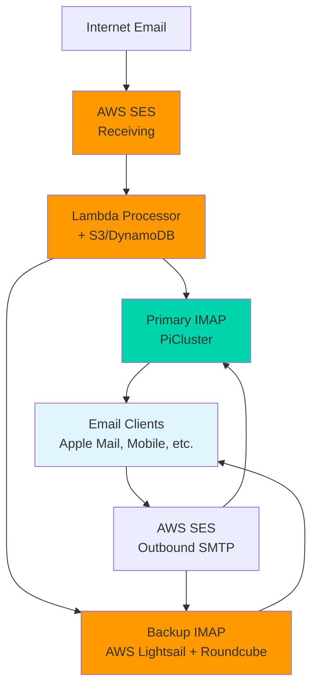

# Email Infrastructure Design Document

## Overview

This document outlines the design for a hybrid email infrastructure for the `pfeiffer.rocks` domain, combining AWS cloud services with a local Kubernetes cluster to provide reliable email sending, receiving, and access capabilities.

## Architecture Goals

- **Independence**: Move away from email forwarding to direct email handling for `pfeiffer.rocks`
- **Reliability**: Implement redundant IMAP access with primary (local) and backup (cloud) servers
- **Cost-Effectiveness**: Minimize monthly costs while maintaining professional email capabilities
- **Scalability**: Use cloud storage for centralized email data accessible by multiple IMAP servers
- **Security**: Implement proper SSL/TLS encryption and secure authentication
- **EU Compliance**: Deploy in eu-central-1 for GDPR compliance and EU data residency

## High-Level Architecture



## Component Details

### 1. Email Receiving (AWS SES + Lambda + Storage)

#### AWS SES Configuration
- **Domain**: `pfeiffer.rocks`
- **MX Records**: Point to AWS SES endpoints (`inbound-smtp.us-east-1.amazonaws.com`)
- **Verification**: Domain and DKIM verification for deliverability
- **Spam/Virus Filtering**: Built-in AWS SES filtering capabilities

#### Lambda Email Processor
- **Trigger**: AWS SES receipt rules
- **Function**: Process incoming emails and store in multiple formats
- **Processing Steps**:
  1. Parse raw email from S3 (where SES initially stores it)
  2. Extract metadata (from, to, subject, timestamp, etc.)
  3. Store metadata in DynamoDB for fast querying
  4. Store processed email in S3 in standard RFC822 format
  5. Create manifest files for efficient IMAP syncing

#### Storage Architecture
- **S3 Bucket Structure**:
  ```
  email-storage-bucket/
  ├── incoming/           # Raw emails from SES
  ├── processed/          # RFC822 formatted emails for IMAP
  └── manifest/           # Sync metadata organized by date
      └── YYYY/MM/DD/     # Daily organization for efficient querying
  ```
- **DynamoDB Table**: Email metadata index for fast searching and filtering

### 2. Email Sending (AWS SES SMTP)

#### Configuration
- **SMTP Endpoint**: `email-smtp.us-east-1.amazonaws.com:587`
- **Authentication**: AWS SES SMTP credentials
- **Security**: TLS encryption for all connections
- **Domain Authentication**: SPF, DKIM, and DMARC records

#### Integration Points
- **Primary IMAP Server**: Direct SMTP relay for sent folder sync
- **Backup IMAP Server**: Same SMTP configuration for redundancy
- **Web Interface**: Integrated SMTP for webmail sending
- **Applications**: Available for automated emails from cluster services

### 3. Primary IMAP Server (PiCluster)

#### Deployment Architecture
- **Platform**: Kubernetes deployment on PiCluster
- **IMAP Server**: Dovecot in containerized deployment
- **Email Sync**: Python service syncing emails from S3/DynamoDB
- **Storage**: Persistent volume for local email cache
- **Networking**: Exposed via LoadBalancer or Cloudflare Tunnel

#### Components
```yaml
Primary IMAP Pod:
├── dovecot-container      # IMAP/IMAPS server (ports 143/993)
├── email-syncer          # Background S3 sync service
└── shared-storage        # PVC for Maildir format storage
```

#### Sync Strategy
- **Frequency**: Every 60 seconds
- **Direction**: One-way from S3 to local Maildir
- **Incremental**: Only sync emails newer than last sync timestamp
- **Format**: Standard Maildir format for Dovecot compatibility

### 4. Backup IMAP Server (AWS Lightsail)

#### Platform
- **Service**: AWS Lightsail micro instance ($5/month)
- **OS**: Ubuntu 20.04 LTS
- **Installation**: Direct package installation (no Docker)
- **Resources**: 1GB RAM, 1 vCPU, 40GB SSD

#### Components
- **Dovecot**: IMAP server (same configuration as primary)
- **Nginx**: Web server for Roundcube
- **Roundcube**: Web-based email interface
- **Email Sync**: Python script with systemd timer
- **SSL**: Let's Encrypt certificates via Certbot

#### Web Interface Access
- **URL**: `https://backup.pfeiffer.rocks`
- **Features**: Full webmail functionality, attachment support, mobile-responsive
- **Authentication**: Same credentials as IMAP servers

## Data Flow

### Incoming Email Flow
1. **Email Arrival**: External email arrives at AWS SES
2. **Initial Storage**: SES stores raw email in S3 `incoming/` prefix
3. **Lambda Processing**: Triggered by SES, processes email metadata
4. **Metadata Storage**: Email metadata stored in DynamoDB
5. **Processed Storage**: Clean RFC822 email stored in S3 `processed/` prefix
6. **Primary Sync**: PiCluster email-syncer downloads new emails every 60s
7. **Backup Sync**: Lightsail email-syncer downloads same emails every 60s
8. **Client Access**: Email clients connect to either IMAP server

### Outgoing Email Flow
1. **Client Send**: Email client sends via AWS SES SMTP
2. **SES Processing**: AWS SES handles delivery and reputation management
3. **Delivery**: Email delivered to recipient
4. **Sent Folder**: Sent emails stored in appropriate IMAP sent folder

## Failover and Redundancy

### Primary Server Failure
- **Detection**: DNS health checks or manual switching
- **Client Fallback**: Apple Mail configured with both accounts
- **Web Access**: Always available via Lightsail backup
- **Data Consistency**: Both servers sync from same S3 source

### AWS Service Failures
- **SES Outage**: MX record failover to secondary email service
- **S3 Outage**: Email receiving paused, existing emails still accessible
- **Lambda Outage**: Emails stored in S3 but not processed until recovery

## Security Considerations

### Transport Security
- **IMAP**: SSL/TLS encryption (port 993) mandatory
- **SMTP**: TLS encryption (port 587) mandatory
- **Web**: HTTPS only with valid certificates
- **Internal**: All cluster communications encrypted

### Authentication
- **IMAP**: Static password authentication (can be upgraded to LDAP)
- **SMTP**: AWS SES credentials
- **Web**: Same credentials as IMAP for simplicity

### Access Control
- **Firewall**: Only necessary ports exposed (993, 80, 443)
- **AWS IAM**: Minimal permissions for Lambda and sync services
- **TLS Certificates**: Let's Encrypt for domain validation

## Cost Analysis

### Monthly Costs
- **AWS SES**: ~$1/month (1,000 emails)
- **S3 Storage**: ~$2/month (10GB email storage)
- **DynamoDB**: Free tier (sufficient for personal use)
- **Lambda**: Free tier (sufficient for email processing)
- **Lightsail**: $5/month (micro instance)
- **Total**: ~$8/month

### Cost Optimization
- **S3 Lifecycle**: Archive old emails to cheaper storage classes
- **DynamoDB**: Use on-demand pricing for variable usage
- **Lightsail**: Fixed pricing prevents unexpected charges

## Implementation Phases

### Phase 1: Core Infrastructure (Week 1)
1. Set up AWS SES receiving for `pfeiffer.rocks`
2. Implement Lambda email processor
3. Configure S3 bucket and DynamoDB table
4. Deploy primary IMAP server on PiCluster
5. Test email receiving and IMAP access

### Phase 2: Backup Infrastructure (Week 2)
1. Provision AWS Lightsail instance
2. Install and configure Dovecot on Lightsail
3. Set up Roundcube web interface
4. Configure email sync service
5. Test redundancy and failover

### Phase 3: Client Configuration (Week 3)
1. Configure Apple Mail with both accounts
2. Set up SSL certificates and DNS
3. Implement monitoring and health checks
4. Document user procedures
5. Perform end-to-end testing

### Phase 4: Optimization (Week 4)
1. Implement automated failover
2. Add monitoring and alerting
3. Optimize sync performance
4. Security hardening
5. Backup and disaster recovery procedures

## Monitoring and Maintenance

### Key Metrics
- **Email Delivery**: SES bounce and complaint rates
- **Sync Performance**: Sync latency and success rates
- **IMAP Performance**: Connection times and throughput
- **Storage Usage**: S3 and local storage growth
- **System Health**: Server uptime and resource usage

### Maintenance Tasks
- **Monthly**: Review AWS costs and usage
- **Quarterly**: Update SSL certificates (automated)
- **Bi-annually**: Security updates and patches
- **Annually**: Review and optimize architecture

## Risk Assessment

### High Risk
- **Email Loss**: Mitigated by S3 durability and multiple sync targets
- **Service Outage**: Mitigated by backup IMAP server
- **Security Breach**: Mitigated by TLS, minimal attack surface

### Medium Risk
- **Cost Overrun**: Mitigated by fixed-price Lightsail and monitoring
- **Complexity**: Mitigated by documentation and automation

### Low Risk
- **Performance Issues**: Mitigated by small scale and monitoring
- **Compatibility**: Mitigated by standard protocols (IMAP, SMTP)

## Success Criteria

1. **Functional**: Send and receive emails directly for `pfeiffer.rocks`
2. **Reliable**: 99.9% uptime with automatic failover
3. **Cost-Effective**: Total monthly cost under $10
4. **User-Friendly**: Seamless experience in Apple Mail and web interface
5. **Secure**: All communications encrypted, no security incidents
6. **Maintainable**: Clear documentation and minimal maintenance overhead

## Future Enhancements

### Short-term (3-6 months)
- **Mobile Push**: Implement push notifications for mobile devices
- **Advanced Filtering**: Add server-side email filtering and rules
- **Monitoring Dashboard**: Create unified monitoring interface

### Long-term (6-12 months)
- **Multi-Domain**: Extend to support additional domains
- **Advanced Auth**: Implement LDAP or OAuth authentication
- **Compliance**: Add encryption-at-rest and audit logging

## Conclusion

This design provides a robust, cost-effective email infrastructure that meets the requirements of independence from external email providers while maintaining reliability through redundancy. The hybrid cloud-local approach leverages the strengths of both AWS managed services and local control, resulting in a scalable and maintainable solution.
